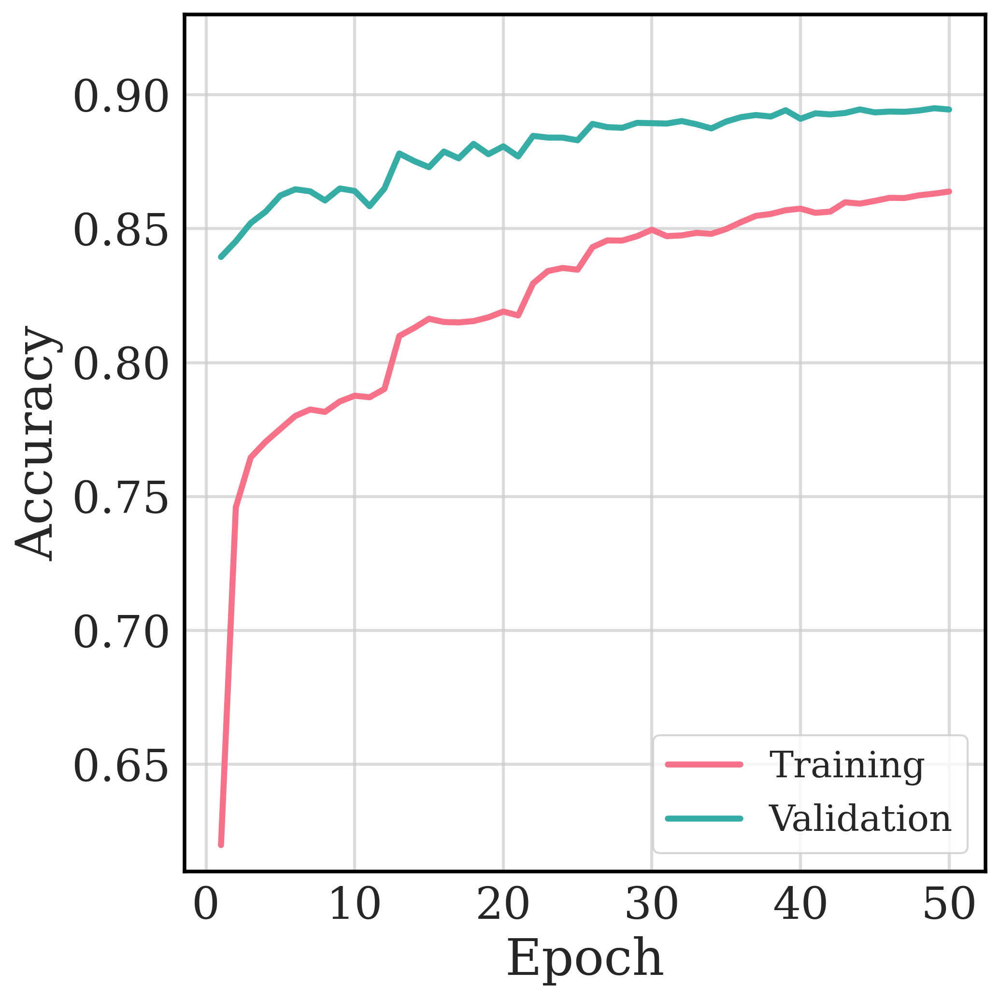
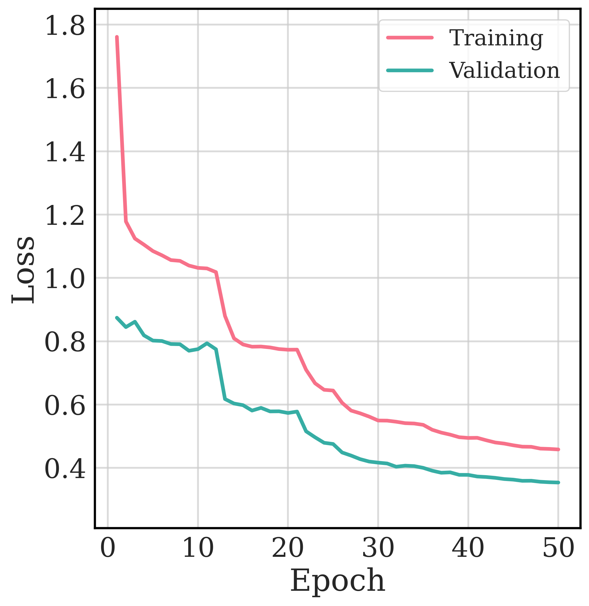

# OCR Character Recognition - CNN vs Random Forest vs SVM

A comprehensive Optical Character Recognition (OCR) system comparing CNN, Random Forest, and SVM classifiers on the EMNIST Balanced dataset (47 classes: digits 0-9, uppercase A-Z, and 11 specific lowercase letters).

## Features

- **Three Model Architectures**: Deep Learning CNN, Random Forest, and SVM classifiers
- **EMNIST Balanced Dataset**: 47 character classes (112,800 training samples, 18,800 test samples)
  - Digits: 0-9 (10 classes)
  - Uppercase: A-Z (26 classes)
  - Lowercase: a, b, d, e, f, g, h, n, q, r, t (11 classes)
- **Automated Hyperparameter Optimization**: GridSearchCV for Random Forest and SVM
- **Feature Engineering**: HOG (Histogram of Oriented Gradients) features for Random Forest and SVM
- **Data Augmentation**: Rotation, Shifting, Zoom, and Linear Shear for CNN training
- **Performance Metrics**: Accuracy, inference time, training time tracking
- **Visualization Tools**: Training history plots, sample visualization by label

## Requirements

### Python Version
- Python 3.10 or higher

### Install Dependencies

Install all required dependencies using the requirements file:

```bash
pip install -r requirements.txt
```

Or using conda:

```bash
conda create -n btl-ML python=3.10
conda activate btl-ML
pip install -r requirements.txt
```

<details>
<summary>View Package List</summary>

**Core packages:**
- `tensorflow==2.20.0` - Deep learning framework
- `numpy==2.2.6` - Numerical computing
- `pandas==2.3.3` - Data manipulation
- `scikit-learn==1.7.2` - Machine learning algorithms
- `matplotlib==3.10.8` - Plotting and visualization
- `seaborn==0.13.2` - Statistical visualization
- `kagglehub==0.3.13` - Dataset download
- `opencv-python>=4.8.0` - Image processing
- `joblib==1.5.3` - Model serialization
- `scikit-image==0.25.2` - Image processing and HOG features

</details>

## Dataset Download

Download the EMNIST Balanced dataset using Kaggle API:

```bash
python download_data.py
```

This will download the dataset to: `~/.cache/kagglehub/datasets/crawford/emnist/versions/3/`
You have to change the dataset path in the "dataset.py" before using to retrain.

The dataset contains:
- `emnist-balanced-train.csv` - 112,800 training samples
- `emnist-balanced-test.csv` - 18,800 test samples

## Project Structure

```
.
├── dataset.py              # Dataset loader with preprocessing
├── download_data.py        # Script to download EMNIST dataset
│
├── model.py                # CNN model architecture
├── train.py                # Train CNN model
├── inference.py            # Test CNN model on test set
├── inference_image.py      # Predict single image with CNN
│
├── rf_model.py             # Random Forest model wrapper
├── rf_train.py             # Train Random Forest with GridSearchCV
├── rf_inference.py         # Test Random Forest on test set
│
├── svm_model.py            # SVM model wrapper
├── svm_train.py            # Train SVM with GridSearchCV
├── svm_inference.py        # Test SVM on test set
│
├── visualize.py            # Training visualization utilities
├── visualize_samples.py    # Visualize sample images from dataset
├── visualize_sample_by_label.py  # Visualize specific label samples
│
├── weight/                 # Saved models
│   ├── best_ocr_model.h5          # Best CNN model
│   ├── emnist_rf_model.pkl        # Best Random Forest model
│   └── emnist_svm_model_HOG_rbf_best.pkl  # Best SVM model
│
└── epoch_statistic/        # Training logs and plots
    ├── training_log.csv           # CNN training history
    ├── training_accuracy.png/pdf  # CNN accuracy plot
    ├── training_loss.png/pdf      # CNN loss plot
    ├── rf_training_log.csv        # Random Forest best model stats
    ├── rf_cv_iterations.csv       # All Random Forest configurations tested
    ├── svm_training_log.csv       # SVM best model stats
    └── svm_cv_iterations.csv      # All SVM configurations tested
```

## Training

### 1. Train CNN Model

Train the Convolutional Neural Network:

```bash
python train.py
```

**Configuration:**
- Architecture: 3 Block of Conv layers (32, 64, 128 filters) with Pooling + 2 Dense layers (256, 47)
- Optimizer: Adam (lr=0.001 with ReduceLROnPlateau)
- Epochs: 50 (with EarlyStopping patience=7)
- Batch size: 32
- Data augmentation: rotation, shift, zoom, shear

**Outputs:**
- `weight/best_ocr_model.h5` - Best model based on validation accuracy
- `weight/ocr_model.h5` - Final model
- `epoch_statistic/training_log.csv` - Per-epoch training metrics
- `epoch_statistic/training_accuracy.png` - Accuracy plot
- `epoch_statistic/training_loss.png` - Loss plot
Feature extraction: HOG (Histogram of Oriented Gradients)
- Parameter grid (example):
  - `n_estimators`: [100, 200]
  - `max_depth`: [10, 20, 30]
  - `min_samples_leaf`: [2, 4]
- Total combinations tested: 12 (configurable in `rf_train.py`)

**Outputs:**
- `weight/emnist_rf_model.pkl` - Best Random Forest model
- `epoch_statistic/rf_training_log.csv` - Best model summary
- `epoch_statistic/rf_cv_iterations.csv` - All tested configurations with accuracy

### 3. Train SVM Model

Train Support Vector Machine with hyperparameter search:

```bash
python svm_train.py
```

**Configuration:**
- GridSearchCV with 5-fold cross-validation
- Feature extraction: HOG (Histogram of Oriented Gradients)
- Kernel: RBF (Radial Basis Function) or Linear
- Dimensionality reduction: PCA
- Parameter grid (example):
  - `C`: [1, 5, 10] - Regularization parameter
  - `n_components`: [50, 100, 150] - PCA dimensions
- Total combinations tested: 9 (configurable in `svm_train.py`)

**Outputs:**
- `weight/emnist_svm_model_HOG_rbf_best.pkl` - Best SVM model
- `epoch_statistic/svm_training_log.csv` - Best model summary
- `epoch_statistic/svm
- GridSearchCV with 5-fold cross-validation
- Parameter grid:
  - `n_estimators`: [100, 200]
  - `max_depth`: [10, 20, 30]
  - `min_samples_leaf`: [2, 4]
- Total combinations tested: 12

**Outputs:**
- `weight/emnist_rf_model.pkl` - Best Random Forest model
- `epoch_statistic/rf_training_log.csv` - Best model summary
- `epoch_statistic/rf_cv_iterations.csv` - All tested configurations with accuracy

## Inference

### CNN Inference on Test Set


### SVM Inference on Test Set

Evaluate SVM on the entire test set:

```bash
python svm_inference.py
```

**Output:**
- Test accuracy percentage
### Training History Plots (CNN)

Generate training history plots for CNN:

```bash
python visualize.py
```

Creates professional plots in `epoch_statistic/`:
- `training_accuracy.png` / `.pdf`
- `training_loss.png` / `.pdf`

### Visualize Samples by Label

Visualize random samples for a specific character:

```bash
# Visualize character 'q'
python visualize_sample_by_label.py q

# Visualize digit '5'
python visualize_sample_by_label.py 5

# Visualize uppercase 'A'
python visualize_sample_by_label.py A

# Visualize multiple samples (e.g., 10 samples of 'b')
python visualize_sample_by_label.py b -n 10

# Visualize from test set only
python visualize_sample_by_label.py d -d test
```

**Arguments:**
- `label`: Character to visualize (0-9, A-Z, a, b, d, e, f, g, h, n, q, r, t)
- `-n, --num_samples`: Number of random samples to show (default: 1)
- `-d, --dataset`: Dataset to use - train, test, or both (default: both)

Saves PDF to `epoch_statistic/[character].pdf`

## Sample Results

### CNN Training History

The following plots show the CNN model's training progress over epochs:

<div align="center">

#### Training Accuracy


#### Training Loss


</div>

### CNN Prediction Samples

Sample predictions from the CNN model on test images:


## Expected Results

### Random Forest Model
- **Training time**: ~15-20 minutes per fold (varies with configurations)
- **Test accuracy**: ~82-84% (with HOG features)
- **Inference time**: ~5-10 seconds for 18,800 samples (~0.5 ms/sample)
- **Features**: HOG (Histogram of Oriented Gradients)

### SVM Model
- **Training time**: ~2-5 minutes per fold (with PCA dimensionality reduction)
- **Test accuracy**: ~85-87% (with HOG features and RBF kernel)
- **Inference time**: ~10-20 seconds for 18,800 samples (~1 ms/sample)
- **Features**: HOG with PCA dimensionality reduction

Evaluate Random Forest on the entire test set:

```bash
python rf_inference.py
```
Balanced Character Mapping (47 Classes)

The EMNIST Balanced dataset includes 47 character classes with the following mapping:

| Label Range | Characters | Count |
|-------------|------------|-------|
| 0-9         | Digits: `0 1 2 3 4 5 6 7 8 9` | 10 |
| 10-35       | Uppercase: `A B C D E F G H I J K L M N O P Q R S T U V W X Y Z` | 26 |
| 36-46       | Lowercase: `a b d e f g h n q r t` | 11 |

**Note**: Only 11 lowercase letters are included - those that look sufficiently different from their uppercase counterparts to avoid confusion.

### Predict Single Image (CNN only)

Predict character from a custom image:

```bash
python inference_image.py path/to/your/image.png
```

## Visualization

Generate training history plots for CNN:

```bash
python visualize.py
```

Creates professional plots in:
- `training_accuracy.png` / `.pdf`
- `training_loss.png` / `.pdf`

## Expected Results

### CNN Model
- **Training time**: ~20-30 minutes (50 epochs with early stopping)
- **Test accuracy**: ~88-91%
- **Inference time**: ~1-2 seconds for 18,800 samples (~0.1 ms/sample)
**EMNIST CSV Format**: Requires image rotation/flip correction (automatically handled in `dataset.py`)
- **CNN**: Uses data augmentation (rotation, shift, zoom, shear) to improve generalization
- **Random Forest & SVM**: Use HOG features for better performance than raw pixels
- **SVM**: Uses PCA for dimensionality reduction to speed up training
- **GridSearchCV**: Random Forest and SVM use exhaustive hyperparameter search with 5-fold cross-validation
- **Dataset Split**: All models use the same train/test split from the EMNIST Balanced dataset (no additional splitting needed)

## Model Comparison

| Model | Accuracy | Training Time | Inference Speed | Memory Usage |
|-------|----------|---------------|-----------------|--------------|
| CNN | ~89-91% | 20-30 min | Fast (~0.1 ms/sample) | High |
| SVM (HOG+PCA) | ~85-87% | 10-25 min | Medium (~1 ms/sample) | Medium |
| Random Forest (HOG) | ~82-84% | 15-90 min | Fast (~0.5 ms/sample) | High |

**Recommendation**: 
- **Best accuracy**: CNN with data augmentation
- **Best speed/accuracy tradeoff**: SVM with HOG features
- **Most interpretable**: Random Fores
- **Inference time**: ~5-10 seconds for 18,800 samples (~0.5 ms/sample)

## EMNIST Character Mapping

- Labels 0-9: Digits '0'-'9'
- Labels 10-35: Uppercase 'A'-'Z'
- Labels 36-46: Lowercase 'a', 'b', 'd', 'e', 'f', 'g', 'h', 'n', 'q', 'r', 't'

## Notes

- The EMNIST CSV format requires image rotation/flip correction (handled in `dataset.py`)
- CNN uses data augmentation to improve generalization
- Random Forest uses GridSearchCV for optimal hyperparameter selection
- All models use the same train/test split from the EMNIST dataset

## License

This project is for educational purposes.

## Acknowledgments

- EMNIST Dataset: [Cohen et al., 2017](https://www.westernsydney.edu.au/bens/home/reproducible_research/emnist)
- Kaggle Dataset: [crawford/emnist](https://www.kaggle.com/datasets/crawford/emnist)
